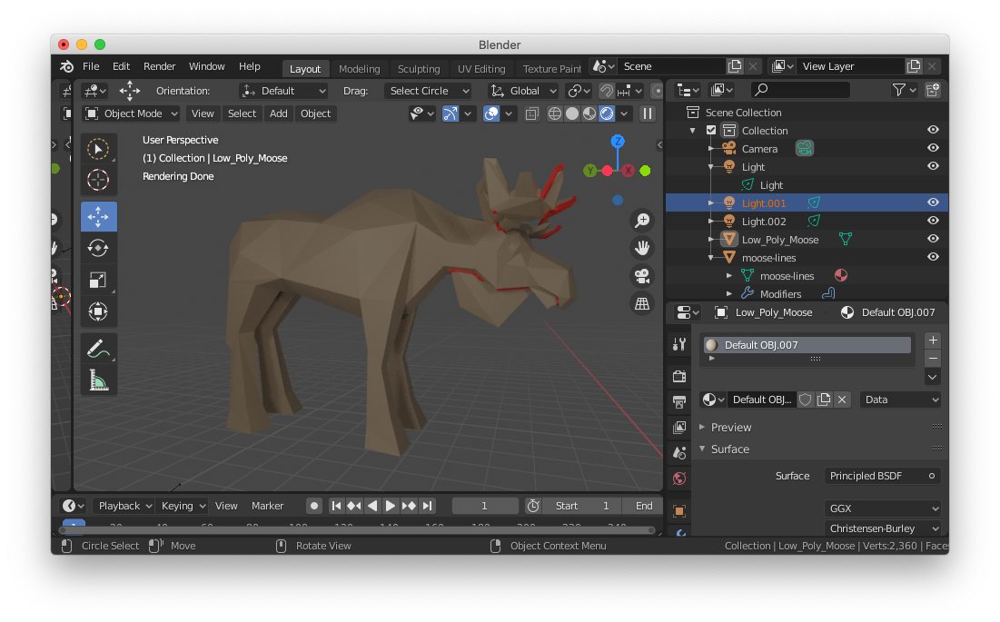

Given a manifold triangle mesh, find all self-intersection contours as a list of
edges and save them to a .obj file using `l` lines.

## build

    mkdir build
    cd build
    cmake ../
    make

## run

    ./self_intersection_curves input.obj output.obj

## blender

`output.obj` can be loaded into blender and rendered by applying the [skin
modifier](https://blender.stackexchange.com/a/3151/14106). You may need to select all vertices and ["Make
Root"](https://blender.stackexchange.com/a/71941/14106)

Alternatively, in blender you may use `Object->convert->curve` then in the curve
properties `geometry->bevel`.

## Example

    ./self_intersection_curves ../Low_Poly_Moose{,-lines}.obj

Should produce `../Low_Poly_Moose-lines.obj` with 344 `l` lines. Rendered in
Blender you get something like:

